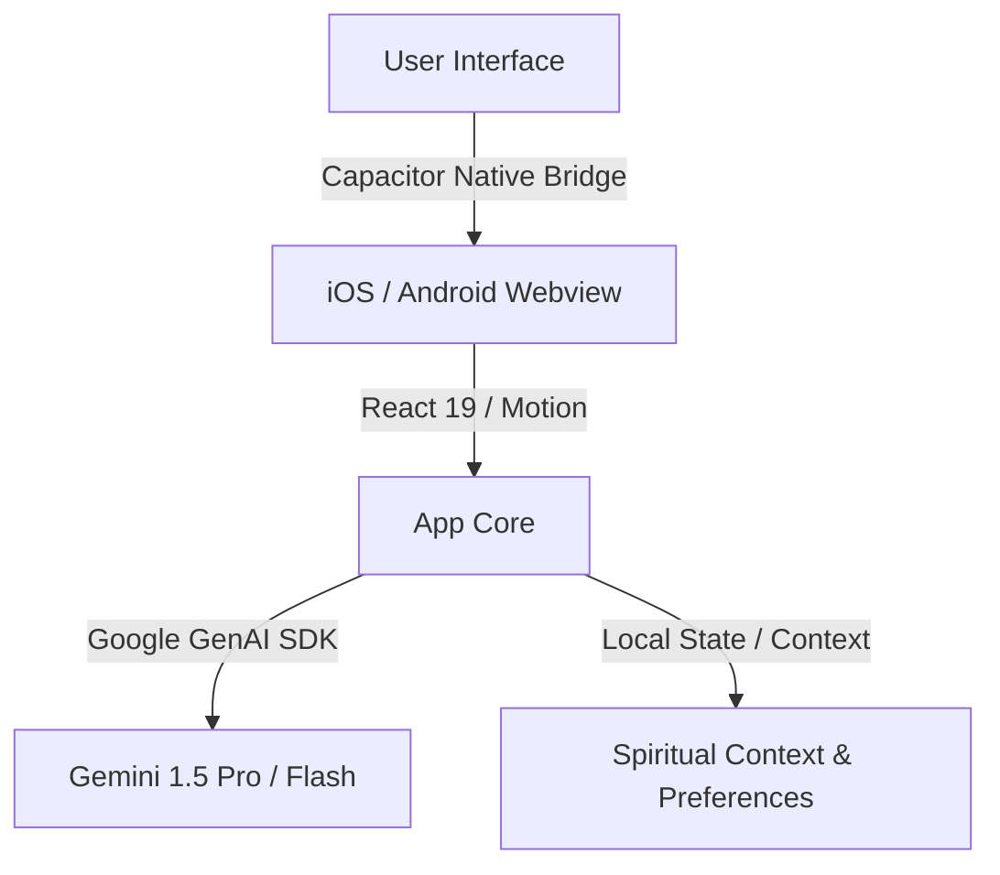

# AETHER-APP: AI-Powered Cosmic & Esoteric Intelligence Hub


## 📖 Abstract

**AETHER-APP** is a modern, cross-platform mobile application engineered with React 19, Vite, and Tailwind CSS v4, deployed natively onto iOS and Android platforms via Capacitor. The application leverages the Google Gemini API (`@google/genai`) to generate real-time, personalized astrological Natal Charts (Soul Maps), dynamic daily horoscopes, and interactive Tarot readings parsed through custom psychoanalytical heuristics.

---

## 🏛️ System Architecture

The application is structured as a client-centric web application packaged into native wrappers for performance and offline capability.



### Key Modules:
1. **Daily Horoscope (`DailyScreen`)**: Dynamic horoscope generation based on Zodiac selectors with keyboard and screen-reader accessibility (complying with Palette standard).
2. **Tarot Reading (`TarotScreen`)**: Esoteric card drawing engine featuring smooth 3D flip card animations driven by Motion.
3. **Soul Map (`SoulMapScreen`)**: Generates and visualizes astrological charts/natal positions based on astronomical metadata.

---

## 🚀 Installation & Local Development

### Prerequisites:
- **Node.js** (v18 or higher)
- **NPM** or **Yarn**
- **Android Studio / Xcode** (for native deployment)

### Setup:
1. Clone the repository and install dependencies:
   ```bash
   npm install
   ```
2. Configure environment variables. Copy `.env.example` to `.env.local` and set your API key:
   ```env
   GEMINI_API_KEY=your_gemini_api_key_here
   ```
3. Run the development server:
   ```bash
   npm run dev
   ```
4. Build the web distribution and sync with Capacitor for native wrappers:
   ```bash
   npm run build
   npx cap sync
   ```

Developed under the spiritual engineering guidelines of the Actagen / Babylon.IA ecosystem.
